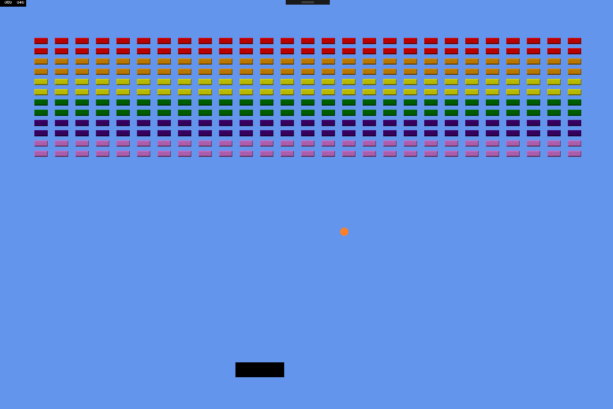

# Bat and Ball (and Dial)

A simple UWP app written using MonoGame, that demonstrates a pong-like game using the Microsoft Dial as a controller.

The app detects the size of the screen, and adapts the display accordingly. A Microsoft Dial is supported, but you can also use the keyboard. Press Space and use the Cursor Left/Right keys!

You can find a more detailed write up on creating a MonoGame UWP app in accompanying blog posts:

* [Get started writing games for WIndows 10 - Part 1](https://blogs.msdn.microsoft.com/johnkenn/2016/11/23/get-started-writing-game-for-window-10/)
* [Get started writing games for Windows 10 - Part 2](https://blogs.msdn.microsoft.com/johnkenn/2016/12/23/get-started-writing-games-for-windows-10-part-2/)
